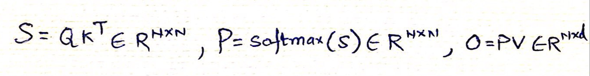
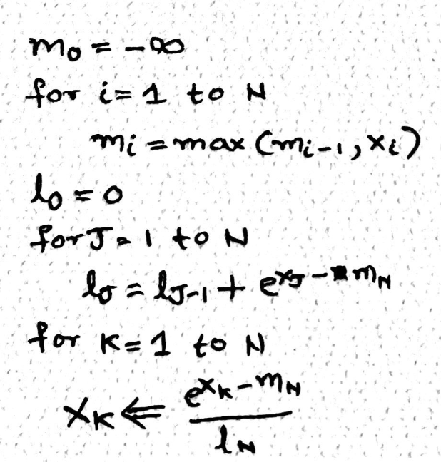
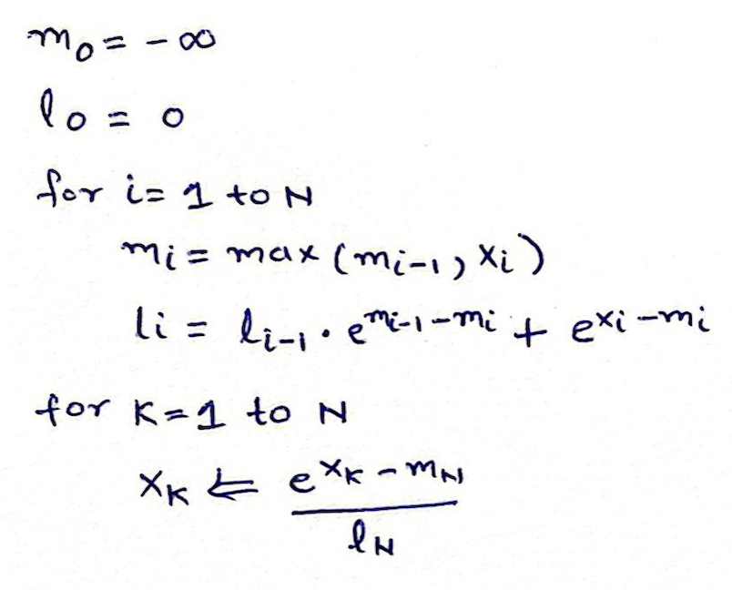
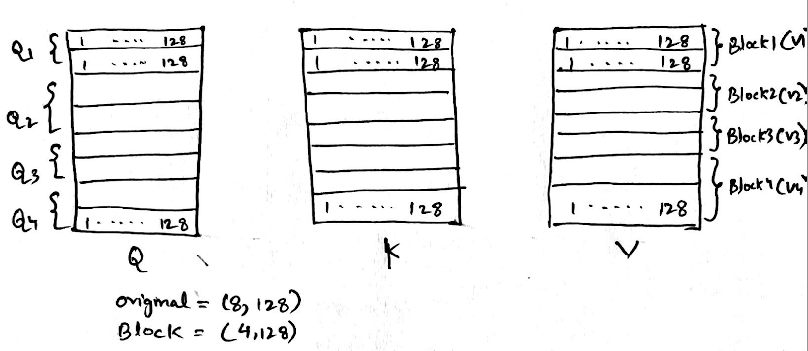
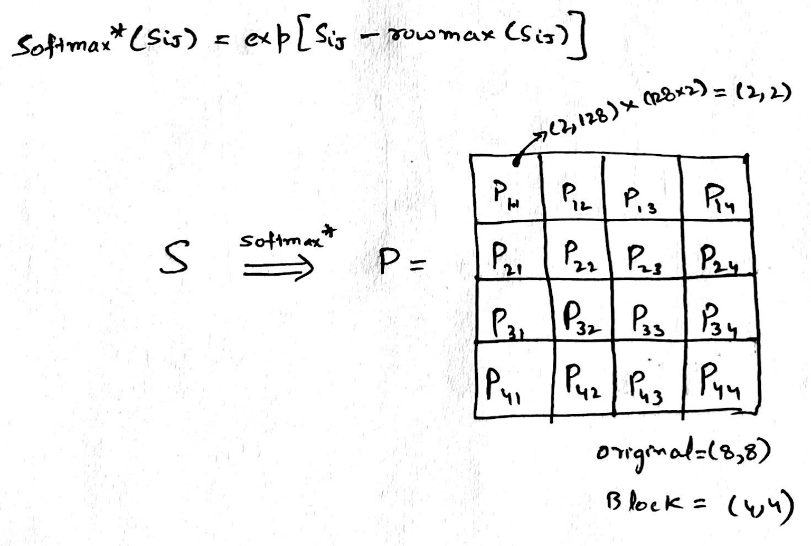
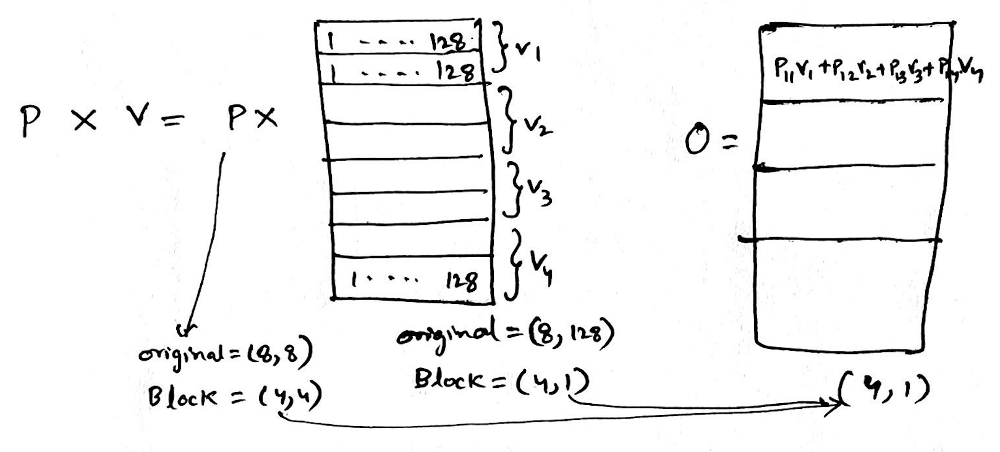

## Introduction

<span style="color:steelblue">This write-up is not written by the GPT</span> of any form, and believe me, it feels good to have typos and grammatical mistakes to feel more human.

I do not want to talk about how neural Networks were inspired using brains, but I do believe the inspiration is quite close. Pay Attention to the closest tokens and learn the affinities between them, and the neurons in the network should fire and wire accordingly. Ultimately, this is magical and mathematical, not chemical though. 

Anyway, my goal was to deeply understand token Attention and implement the most efficient way to calculate it. Using flash attention out of the box was very interesting, but I was very curious to learn the math behind it. 

Without much of a delay, let's get started and deepdive into how the <span style="color:steelblue">Neurons that fire together... wire together (a.k.a Hebbis Theory)</span>


## Table of Contents
1. [Attention Overview](#transformer-architecture-overview)
   - [Understanding Transformer Blocks](#understanding-transformer-blocks)
   - [Self-Attention Mechanism](#self-attention-mechanism)
   - [Multi-Head Attention](#multi-head-attention)
   - [Practical Example: Self-Attention Calculation](#practical-example-self-attention-calculation)
2. [Why Flash Attention?](#why-flash-attention)
3. [Online Softmax Function](#online-softmax-function)
4. [Tiles:Blocks - Applied To Attention](#tilesblocks-applied-to-attention)
5. [Bit about GPUs](#bit-about-gpus)
6. [Triton Implementation](#triton-implementation)
7. [Acknowledgments](#acknowledgments)

## Attention Overview

A modern transformer model like GPT-2 consists of stacked layers (blocks), each containing attention mechanisms and feed-forward neural networks. Here's a simplified view:

```
Input Embeddings + Positional Encodings
↓
Block 1 → Self-Attention → Feed-Forward Network
↓
Block 2 → Self-Attention → Feed-Forward Network
↓
...
↓
Block N → Self-Attention → Feed-Forward Network
↓
Output Layer
```

The two key components of each block are:
- **Self-Attention**: Allows tokens to "look at" other tokens in the sequence
- **Feed-Forward Network**: Processes each token independently

### Understanding Transformer Blocks

Transformer blocks are processed **sequentially**, not in parallel. The output of one block becomes the input to the next.

In the case of GPT-2 (base model), there are 12 blocks stacked on top of each other, creating a deep network:

```python
# From the code
n_layer: int = 12  # number of transformer blocks
```

Each block enriches the representation of the input sequence, with higher blocks capturing increasingly complex patterns and relationships between tokens.

### Self-Attention Mechanism

Self-attention is the heart of transformers. It allows each token in a sequence to "pay attention" to all other tokens (in GPT, only to previous tokens due to the causal mask).

#### The Key Components

For each token, we calculate three vectors:
- **Query (Q)**: What the token is "looking for"
- **Key (K)**: What the token "offers" to be found
- **Value (V)**: The actual information the token passes when attended to

These vectors are created through learned linear transformations of the input embeddings:

```python
# From the code
self.c_attn = nn.Linear(config.n_embd, 3 * config.n_embd)
qkv = self.c_attn(x)
q, k, v = qkv.split(self.n_embd, dim=2)
```

#### Attention Calculation

The attention mechanism calculates how much each token should attend to every other token:

1. Compute attention scores: **S = Q × K^T** (matrix multiplication)
2. Scale the scores: **S = S / √d** (where d is the dimension of the key vectors)
3. Apply masking (for causal attention in GPT models)
4. Apply softmax to get attention weights
5. Compute the weighted sum of values: **Output = Attention_Weights × V**

```python
# From the code
att = (q @ k.transpose(-2, -1)) * (1.0 / math.sqrt(k.size(-1)))
att = att.masked_fill(self.bias[:, :, :T, :T] == 0, float('-inf'))
att = F.softmax(att, dim=-1)
y = att @ v
```

### Multi-Head Attention

Instead of performing a single attention function, transformers use **multiple attention heads** in parallel. In GPT-2 base, there are 12 attention heads:

```python
# From the code
n_head: int = 12  # number of attention heads
```

#### Why Multiple Heads?

Multi-head attention allows the model to:
1. **Focus on different aspects** of relationships between tokens
2. **Attend to different positions** simultaneously
3. **Increase representation capacity** without increasing depth
4. **Create specialized attention patterns** for different types of relationships

#### How Multi-Head Attention Works

1. The input is projected into different subspaces for each head
2. Each head performs its own self-attention calculation
3. The outputs from all heads are concatenated and projected back to the original dimension

```python
# From the code
# Split into heads
q = q.view(B, T, self.n_head, C // self.n_head).transpose(1, 2)  # (B, nh, T, hs)
k = k.view(B, T, self.n_head, C // self.n_head).transpose(1, 2)  # (B, nh, T, hs)
v = v.view(B, T, self.n_head, C // self.n_head).transpose(1, 2)  # (B, nh, T, hs)

# Compute attention for each head
att = (q @ k.transpose(-2, -1)) * (1.0 / math.sqrt(k.size(-1)))
# ... mask and softmax ...
y = att @ v

# Combine heads
y = y.transpose(1, 2).contiguous().view(B, T, C)
y = self.c_proj(y)  # Final projection
```

In GPT-2 base, the embedding dimension is 768, and with 12 heads, each head works with 64-dimensional vectors (768/12 = 64).

### Practical Example: Self-Attention Calculation

Let's walk through a concrete example of how self-attention is calculated for a single head:

Imagine we have a sequence of 4 tokens, each represented by a 64-dimensional vector:

1. We have matrices:
   - Q (4×64): Each row is a query vector for one token
   - K (4×64): Each row is a key vector for one token
   - V (4×64): Each row is a value vector for one token

2. Calculate attention scores S = Q × K^T (resulting in a 4×4 matrix)
   - For each token i, take its query vector qi (row i of Q)
   - Multiply it with each column of K^T (each row of K)
   - This gives a row in S with 4 scores, showing how much token i attends to each token

   For example, to calculate how much token 1 attends to token 2:
   ```
   S[1,2] = Q[1,:] · K[2,:]  (dot product of row 1 of Q and row 2 of K)
   ```

3. Scale the scores: S = S / √64 = S / 8

4. Apply causal masking (in GPT models): Set S[i,j] = -∞ for all j > i
   This creates a lower triangular matrix, ensuring tokens only attend to themselves and previous tokens.

5. Apply softmax to each row of S to get attention weights
   - Each row sums to 1, representing a probability distribution
   - The first row has only one non-zero value (attending only to itself)
   - The last row has values for attending to all tokens

6. Calculate the weighted sum of values:
   - For each token i, take its row of attention weights
   - Compute the weighted sum of all value vectors using these weights
   - This gives the output for token i

From the log file, we can see an example of attention weights after softmax:
```
[[1.0000, 0.0000, 0.0000, 0.0000],
 [0.6405, 0.3595, 0.0000, 0.0000],
 [0.3258, 0.3123, 0.3619, 0.0000],
 [0.0247, 0.0236, 0.0253, 0.9264]]
```

This shows:
- Token 1 fully attends to itself (can't see other tokens)
- Token 2 attends 64% to token 1, 36% to itself
- Token 3 attends roughly equally to tokens 1, 2, and itself
- Token 4 attends most strongly to itself, but also somewhat to tokens 1, 2, and 3

## Why Flash Attention?

Flash Attention is simply a faster way to do the same math that regular Attention does. The key difference is how it manages GPU memory.

I dont know if this is a good example but may help... When a chef (the model/compute-unit) needs ingredients (data) from the refrigerator (computer memory), regular Attention keeps running back and forth, grabbing one ingredient at a time. This wastes a lot of energy and time.

Flash Attention is smarter - it plans ahead and grabs multiple ingredients in one trip, then works with what it has before going back for more. The meal (the mathematical result) turns out exactly the same, but the chef saves a lot of time and energy.

This memory efficiency matters because:
- It makes AI models run much faster
- It reduces energy consumption
- It allows for processing longer texts or bigger images

The end result is identical to regular Attention - just delivered much more efficiently.

## Online Softmax Function
Following is the S (attention), P (softmax) and O (output), lets go through it step by step



Once the query (Q) and key (K) matrices are multiplied, the resulting scores matrix (S) undergoes a softmax transformation applied rowwise. Softmax converts each element into a probability by taking the exponential of the value and normalizing it against the sum of exponentials in the row. This ensures non-negative outputs and amplifies differences between small and large values, aiding model differentiation. However, to avoid extremely large exponentials (e.g., e¹⁰⁰), we apply a numerical stability trick by subtracting the row's maximum value before exponentiation. Importantly, this requires the entire row to be in GPU memory during computation.


The softmax algorithm can be broken down into three main steps, typically implemented using three separate loops. First, we find the maximum value in the row to ensure numerical stability. Second, we compute the normalization factor the sum of exponentials of each adjusted element. Finally, we calculate the softmax for each element by dividing its exponential by this sum. Each step involves O(N) time complexity and memory reads, totaling three passes over the data. This raises a natural question -> can we optimize or fuse these loops for better performance?



Yes we can make this better and more efficient by fusing the first two operations together, meaning that we iterate through the elements row/list - calculate local maximum and simultaneously calculate the normalization using the local maximum. Question is as we move through the list (left to right), how do we then update the maximum or fill for the delta. Here is the magic of mathematics, while calculating the normalization (l), we multiple it with a correction factor called e^(local max – global max), in nutshell everytime we encounter a number bigger than the current maximum we can fix the normalization constant computed so far using the correction factor.



And now we have only two loops and online softmax available. This is going to be very useful when we perform flash.

## Tiles:Blocks - Applied To Attention
We will now look into block matrix multiplication, blocks are collections of rows or columns grouped together for speeding up the computation in parallel. 

Lets walkthrough it step by step,
- We start with Q, K and V, each (8 tokens, 128 sequence length) divided into 4 blocks, each block is made up of 2 tokens or 2 rows,

   

- Next step is Q * K Transpose, after blocking the size of Q is (4,1) and K is (1, 4)

   

- The resultant of the above is S, the size of S will now be (4, 4), and each element of S will be of size (2,2)

   

- Now we perform softmax over S, it is a partial softmax i.e. we only calculate the numerator and not the denominator(a.k.a normalization). Here each element of S (Sij) is processed to get corresponding partial softmax element P(ij) for P, while doing this we only use local maximum (localrowmax(Sij)) to get each P(ij) elements, which means at some point in future we need to fix this and add back what we lost due to not using global maximum from the complete row of S.

   

- Now, lets multiply with V, at this point we still havent fixed the global maxima part described above,

   

In nutshell, the general Algorithm looks like following, each block of Q is getting multiplied with block of K, over which a partial softmax is performed (only numerator with local maxima), output we get is P, P is then multiplied with block of V, ultimately we get output O. 


### Detailed Algorithm

Time to fix the problem we have with each P(ij) element, since it was independently calculated with local maxima, what we can do is apply online softmax to the blocks of rows.

We will have 4 steps at each row, e.g. P11V1 + P12V2 + P13V3 + P14V4, each step below is calculating the element of the row 
 - We initialize maximum (m0) from infinity to infinity 
 - We initialize normalization (l0) 
 - We start with O0 which is of size (2,128) in our case above
    - O0 here is representing each element of the row e.g. P11V1, implicitly P11 is made up of 2 blocks and 128 columns
 - We will never normalize the softmax during the steps, we do it only at the last step
 - In Step 1 
    - We calculate the max m1 using the max function between the rowmax of Q1K1 and m0
    - Then we calculate S1, 
    - We calculate l1 normalization, but dont use it yet, it is the row sum of exponential of S1 – m1 added with l0 * exponential of m0 – m1. Intuitively, local normalization factor at step 1 which is suppose to be the denominator, is the sum of exponentials of all elements in S1 minus the current max, we also add the previous normalization factor l0 to start fixing the global maxima problem described above. 
   - We then calculate P (softmax, only numerator) simply as exponential of S1 – m1
   - Output O1(first row of the output) is then (P11 * V1) + O0 i.e. softmax * value + previous output
      - At each step we multiply diagonal matrix made up of exp(m...) with output at that step, this ensures that iterative maxima is applied to both the rows of the output.
 - We go through all the steps and at the end use final l for normalization.


## Bit about GPUs

Let’s briefly explore the architectures of CPUs and GPUs. CPUs are designed with dynamic memory hierarchies featuring L3, L2, and L1 caches and typically contain a few powerful cores optimized for sequential and parallel processing. In contrast, GPUs are built for high-throughput tasks, with high-bandwidth memory (e.g.HBM), and multiple control units, each with their own L1 caches. The control units is where it decides what next instruction to execute and is the most silicon-intensive and expensive part of the Chip. That is why each core/thread doesnt have its own control unit (in GPU).

To illustrate how GPUs operate, consider adding two vectors of size 10. The CPU first transfers the vectors from DRAM to the GPU. The GPU then spawns a warp of 32 threads (as it operates in multiples of 32), even though only 10 threads will process meaningful data in our case. The instruction such as vector addition is stored once in the GPU’s instruction cache and broadcast to all 32 threads. Each thread executes the same instruction in parallel, but only the first 10 threads perform actual computation, the remaining 22 dont have any output. The 22 of these threads or core will have to work on the same instruction although no output, this is also called control divergence. Every thread/core has its own local data, typically held in fast-access registers.

- ALUs (light green) -> These are the cores/threads
- CTL (light blue) -> These are control units
- L1 (light yellow) -> This is L1 cache


Imagine now a case where we have N=10^6 i.e. one million elements to be added, in this case we can divide the input N into blocks, where each block_size is N/num_cores and num_blocks(grid) is N/block_size. Now when we launch a CUDA kernel, it will assign block Ids like block0, block1 and so forth. Under each block it will assign threads/cores like T0, T1, T2... and so forth

## Triton Implementation

My favorite place to dive into Triton has to be [OpenAI's Triton page](https://openai.com/index/triton/) it's an absolute gem. It’s rare to find a language that makes you feel like you’re writing high performance code with the elegance of Python and the muscle of CUDA.

One of the most fascinating examples is how **Flash Attention** is implemented. If you’ve ever wondered how large models handle attention efficiently without running into memory bottlenecks, Triton gives you the tools (and joy!) to see it firsthand. The implementation of [Triton Flash Attention](/src/triton/fused_attention.py) is a sleek, low-level dance of parallelism and precision based on the cutting edge **Flash Attention v2** algorithm from [Tri Dao](https://tridao.me/publications/flash2/flash2.pdf), which itself is an evolution of the original breakthrough described in [this paper](https://arxiv.org/abs/2205.14135).

If you love AI, performance, or just the magic of computing this is your playground.

## **Acknowledgments**  

A heartfelt thank you to [Tri Dao](https://tridao.me/publications/flash2/flash2.pdf) and Umar Jamil, your brilliant work on Flash Attention laid the groundwork for everything shared above. Your code wasn’t just a reference, it was the learning curve, the inspiration, and the engine behind my understanding.

A huge shoutout to [Lambda Cloud’s GPU instances](https://cloud.lambdalabs.com/) my goto training environment for powerful and efficient computing.

Love for AI, that's all that matters!