## Introduction

<span style="color:steelblue">This write-up is not written by the GPT</span> of any form, and believe me, it feels good to have typos and grammatical mistakes to feel more human.

I do not want to talk about how neural Networks were inspired using brains, but I do believe the inspiration is quite close. Pay Attention to the closest tokens and learn the affinities between them, and the neurons in the network should fire and wire accordingly. Ultimately, this is magical and mathematical, not chemical though. 

Anyway, my goal was to deeply understand token Attention and implement the most efficient way to calculate it. Using flash attention out of the box was very interesting, but I was very curious to learn the math behind it. 

Without much of a delay, let's get started and deepdive into how the <span style="color:steelblue">Neurons that fire together... wire together (a.k.a Hebbis Theory)</span>


## Table of Contents
1. [Attention Overview](#transformer-architecture-overview)
   - [Understanding Transformer Blocks](#understanding-transformer-blocks)
   - [Self-Attention Mechanism](#self-attention-mechanism)
   - [Multi-Head Attention](#multi-head-attention)
   - [Practical Example: Self-Attention Calculation](#practical-example-self-attention-calculation)
2. [Why Flash Attention?](#why-flash-attention)
3. [Online Softmax Function](#online-softmax-function)
4. [Tiles:Blocks - Applied To Attention](#tilesblocks-applied-to-attention)

## Attention Overview

A modern transformer model like GPT-2 consists of stacked layers (blocks), each containing attention mechanisms and feed-forward neural networks. Here's a simplified view:

```
Input Embeddings + Positional Encodings
↓
Block 1 → Self-Attention → Feed-Forward Network
↓
Block 2 → Self-Attention → Feed-Forward Network
↓
...
↓
Block N → Self-Attention → Feed-Forward Network
↓
Output Layer
```

The two key components of each block are:
- **Self-Attention**: Allows tokens to "look at" other tokens in the sequence
- **Feed-Forward Network**: Processes each token independently

### Understanding Transformer Blocks

Transformer blocks are processed **sequentially**, not in parallel. The output of one block becomes the input to the next.

In the case of GPT-2 (base model), there are 12 blocks stacked on top of each other, creating a deep network:

```python
# From the code
n_layer: int = 12  # number of transformer blocks
```

Each block enriches the representation of the input sequence, with higher blocks capturing increasingly complex patterns and relationships between tokens.

### Self-Attention Mechanism

Self-attention is the heart of transformers. It allows each token in a sequence to "pay attention" to all other tokens (in GPT, only to previous tokens due to the causal mask).

#### The Key Components

For each token, we calculate three vectors:
- **Query (Q)**: What the token is "looking for"
- **Key (K)**: What the token "offers" to be found
- **Value (V)**: The actual information the token passes when attended to

These vectors are created through learned linear transformations of the input embeddings:

```python
# From the code
self.c_attn = nn.Linear(config.n_embd, 3 * config.n_embd)
qkv = self.c_attn(x)
q, k, v = qkv.split(self.n_embd, dim=2)
```

#### Attention Calculation

The attention mechanism calculates how much each token should attend to every other token:

1. Compute attention scores: **S = Q × K^T** (matrix multiplication)
2. Scale the scores: **S = S / √d** (where d is the dimension of the key vectors)
3. Apply masking (for causal attention in GPT models)
4. Apply softmax to get attention weights
5. Compute the weighted sum of values: **Output = Attention_Weights × V**

```python
# From the code
att = (q @ k.transpose(-2, -1)) * (1.0 / math.sqrt(k.size(-1)))
att = att.masked_fill(self.bias[:, :, :T, :T] == 0, float('-inf'))
att = F.softmax(att, dim=-1)
y = att @ v
```

### Multi-Head Attention

Instead of performing a single attention function, transformers use **multiple attention heads** in parallel. In GPT-2 base, there are 12 attention heads:

```python
# From the code
n_head: int = 12  # number of attention heads
```

#### Why Multiple Heads?

Multi-head attention allows the model to:
1. **Focus on different aspects** of relationships between tokens
2. **Attend to different positions** simultaneously
3. **Increase representation capacity** without increasing depth
4. **Create specialized attention patterns** for different types of relationships

#### How Multi-Head Attention Works

1. The input is projected into different subspaces for each head
2. Each head performs its own self-attention calculation
3. The outputs from all heads are concatenated and projected back to the original dimension

```python
# From the code
# Split into heads
q = q.view(B, T, self.n_head, C // self.n_head).transpose(1, 2)  # (B, nh, T, hs)
k = k.view(B, T, self.n_head, C // self.n_head).transpose(1, 2)  # (B, nh, T, hs)
v = v.view(B, T, self.n_head, C // self.n_head).transpose(1, 2)  # (B, nh, T, hs)

# Compute attention for each head
att = (q @ k.transpose(-2, -1)) * (1.0 / math.sqrt(k.size(-1)))
# ... mask and softmax ...
y = att @ v

# Combine heads
y = y.transpose(1, 2).contiguous().view(B, T, C)
y = self.c_proj(y)  # Final projection
```

In GPT-2 base, the embedding dimension is 768, and with 12 heads, each head works with 64-dimensional vectors (768/12 = 64).

### Practical Example: Self-Attention Calculation

Let's walk through a concrete example of how self-attention is calculated for a single head:

Imagine we have a sequence of 4 tokens, each represented by a 64-dimensional vector:

1. We have matrices:
   - Q (4×64): Each row is a query vector for one token
   - K (4×64): Each row is a key vector for one token
   - V (4×64): Each row is a value vector for one token

2. Calculate attention scores S = Q × K^T (resulting in a 4×4 matrix)
   - For each token i, take its query vector qi (row i of Q)
   - Multiply it with each column of K^T (each row of K)
   - This gives a row in S with 4 scores, showing how much token i attends to each token

   For example, to calculate how much token 1 attends to token 2:
   ```
   S[1,2] = Q[1,:] · K[2,:]  (dot product of row 1 of Q and row 2 of K)
   ```

3. Scale the scores: S = S / √64 = S / 8

4. Apply causal masking (in GPT models): Set S[i,j] = -∞ for all j > i
   This creates a lower triangular matrix, ensuring tokens only attend to themselves and previous tokens.

5. Apply softmax to each row of S to get attention weights
   - Each row sums to 1, representing a probability distribution
   - The first row has only one non-zero value (attending only to itself)
   - The last row has values for attending to all tokens

6. Calculate the weighted sum of values:
   - For each token i, take its row of attention weights
   - Compute the weighted sum of all value vectors using these weights
   - This gives the output for token i

From the log file, we can see an example of attention weights after softmax:
```
[[1.0000, 0.0000, 0.0000, 0.0000],
 [0.6405, 0.3595, 0.0000, 0.0000],
 [0.3258, 0.3123, 0.3619, 0.0000],
 [0.0247, 0.0236, 0.0253, 0.9264]]
```

This shows:
- Token 1 fully attends to itself (can't see other tokens)
- Token 2 attends 64% to token 1, 36% to itself
- Token 3 attends roughly equally to tokens 1, 2, and itself
- Token 4 attends most strongly to itself, but also somewhat to tokens 1, 2, and 3

## Why Flash Attention?

The actual input and output has no change, meaning the flash attention is not calculating anything different, it is very much working on getting the attention scores or effinities between the tokens. Then why do we need flash?
Flash is important because of the way it calculates the attention scores, meaning it improves the read/write or IO, basically the throughput.
<TODO>

## Online Softmax Function
Following is the S (attention), P (softmax) and O (output), lets go through it step by step

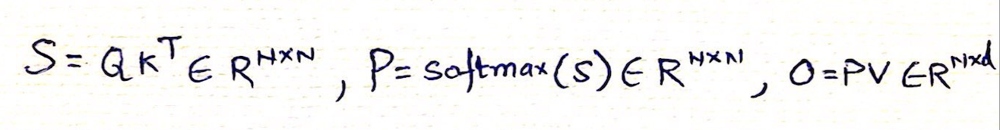

Once the Q and K are multiplied, the softmax function is then applied to the output S, softmax here is applied to the complete row. This is an important aspect to understand, let us dive in
Basic softmax implementation, applied on each element of the row, softmax is the exponential of the element normalized by the sum of exponentials of all elements. Exponential helps ensuring non-negativity i.e. keeping all values to positive, exponentials also help in enlarging the numbers to ensure the small and large numbers are clearly different, also exponentiality allows a better differentiability. 
But there is a problem, we need to ensure that already existing large elements or numbers in the row are not becoming too large e.g. e pow 100, there we will normalize this by using x(i) - x(max), where x(max) is the maximum elements in the row. Intiutively this also means that you need to have this complete row available in the compute memory (gpu) at same time :)

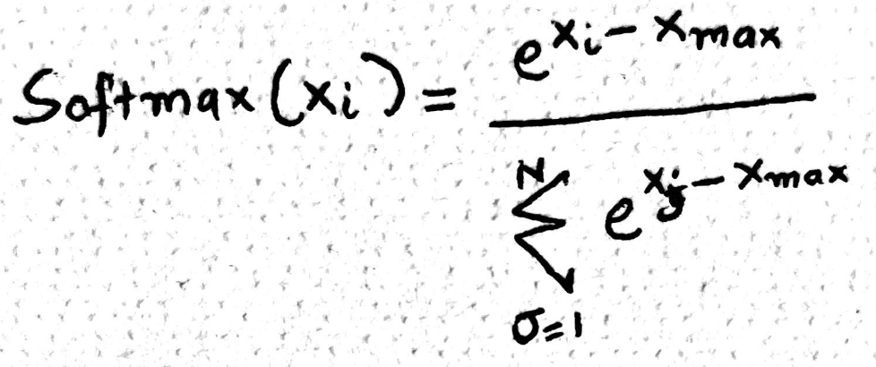

Softmax algorithm basically is a three for loop setting, first we find out the max of the elements in the row, second we calculate the normalization factor i.e. the denominator, lastly we calculate the softmax of each element in the row by dividing the numerator by denominator from the above. 
At each step, we are using O(N) time complexity and memory reads. Three loops. Can we make this better?

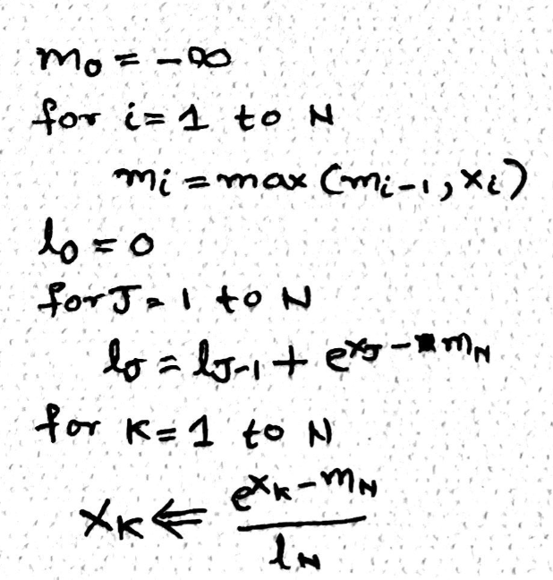

Yes we can make this better and more efficient by fusing the first two operations together, meaning that we iterate through the elements row/list - calculate local maximum and simultaneously calculate the normalization using the local maximum. Question is as we move through the list (left to right), how do we then update the maximum or fill for the delta. Here is the magic of mathematics, while calculating the normalization (l), we multiple it with a correction factor called e^(local max – global max), in nutshell everytime we encounter a number bigger than the current maximum we can fix the normalization constant computed so far using the correction factor.

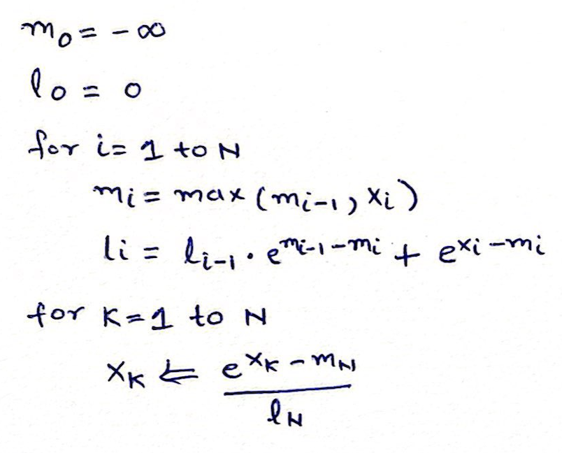

And now we have only two loops and online softmax available. This is going to be very useful when we perform flash. The code for same is <>

## Tiles:Blocks - Applied To Attention
We will now look into block matrix multiplication, blocks are collections of rows or columns grouped together for speeding up the computation in parallel. 

Lets walkthrough it step by step,
- We start with Q, K and V, each (8 tokens, 128 sequence length) divided into blocks and divide the original matrix into 4 blocks, each block with 2 tokens or 2 rows,

   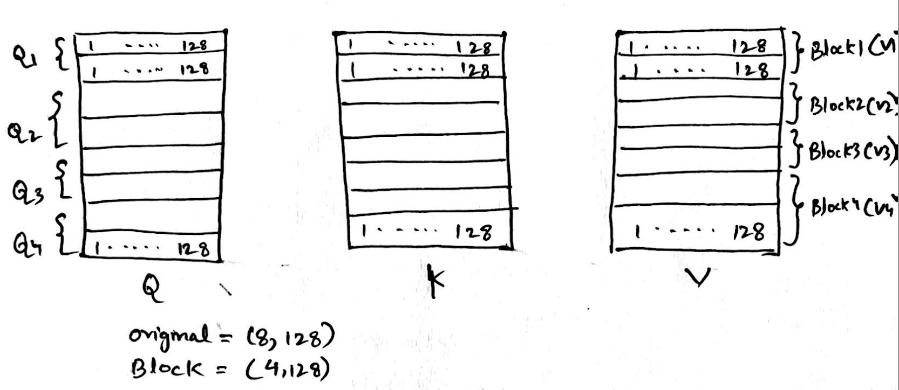

- Next step is Q * K transpose, after blocking the size of Q is (4,1) and K is (1, 4)

   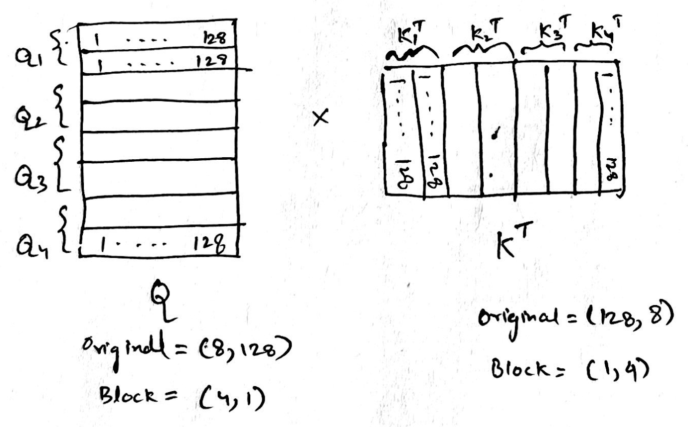

- The resultant of the above is S, the size of S will now be (4, 4), and each element will be of size (2,2)

   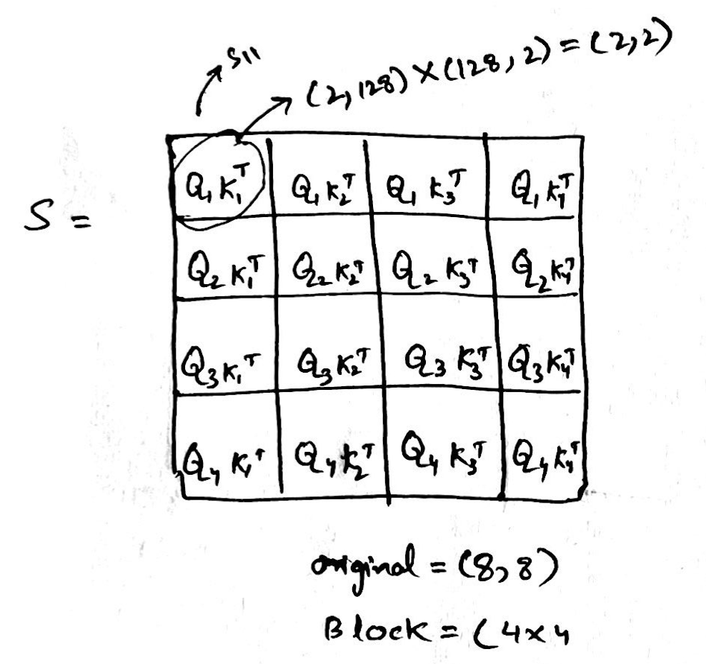

- Now we perform softmax over S, it is partial softmax i.e. we only calculate the numerator , Picture, and not the denominator - i.e. normalization, each element of S is , remember we have used local maximum here to get each P(ij) elements, which means at some point in future we need to fix and add what we lost due to not using global maximum.

   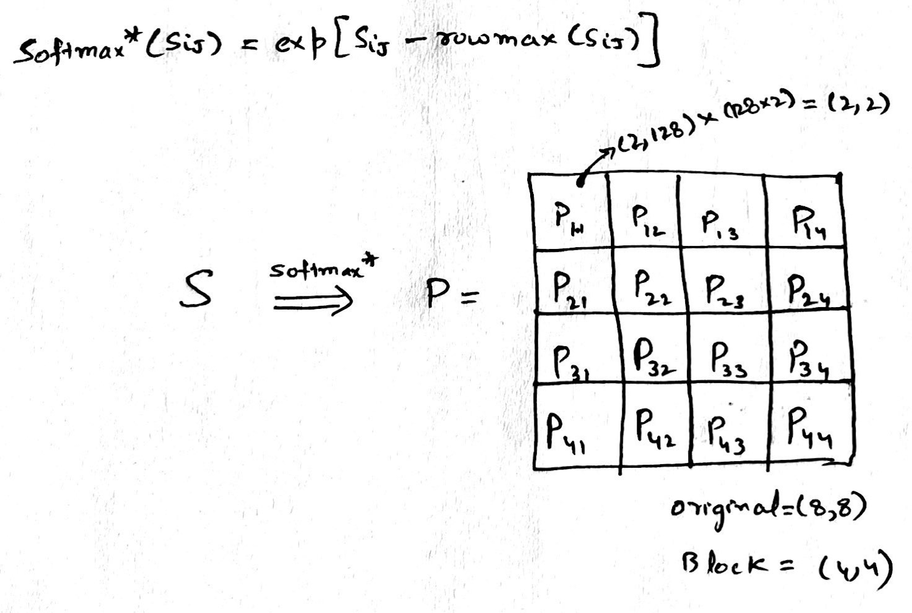

- Now, lets multiply with V, still we havent fixed the global maxima part 

   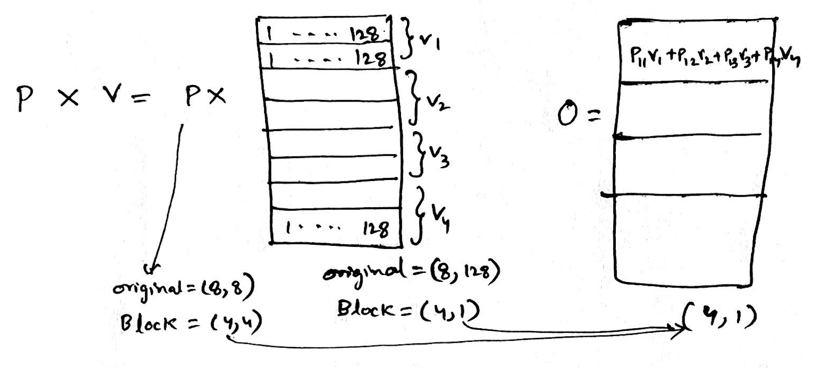

Time to fix the problem we have with each P(ij) element, since it was independently calculated with local maximum, what we can do is apply online softmax to the blocks of rows like we did in the section of softmax. 

General Algorithm looks like following, each block of Q is getting multiplied with block of K, over which a softmax is performed (only numerator with local maxima), output we get is P, P is then multiplied with block of V, ultimately we get Picture 1046361237, Picture. Final outcome is O. 

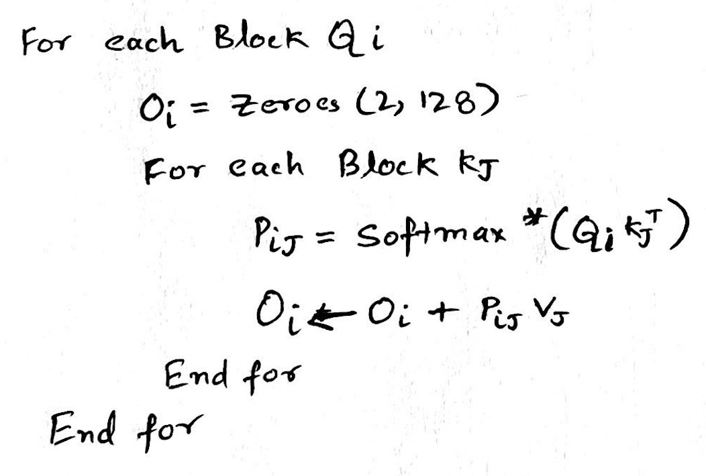

### Detailed Algorithm

- We initialize maximum (m) from infinity to infinity 
- We initialize normalization (l) 
- We start with O which is of size (2,128) in our case above 
- We will never normalize the softmax during the steps, we do it only at the end 
- In Step 1 

  We calculate the max m1 using the max function between the rowmax of Q1K1 and m0 

  Then we calculate S1 

  We calculate l1 normalization, but dont use it yet, it is the row sum of exponential of S1 – m1 added with l0 * exponential of m0 – m1. Intuitively, normalization factor at step 1 which is suppose to be the denominator, is the sum of exponentials of all elements in S1 minus the current max, we also add the previous normalization factor l0 to start fixing the global maxima problem described above. 

- We then calculate P (softmax, only numerator) simply as exponential of S1 – m1
- Output O1 is then P11 * V1 i.e. softmax * value.  

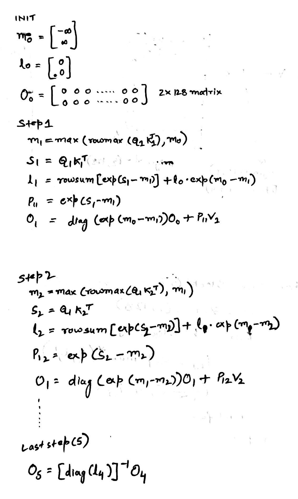